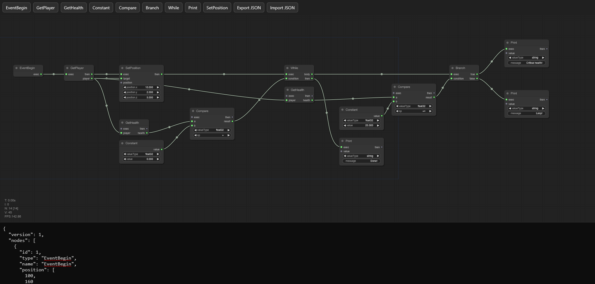

# Kettle

> Brewing ideas. Literally.

_(I just thought the idea was funny)_

Kettle is a small experimental node-based scripting system built quickly in a gamejam-like fashion, so some features are still incomplete.
The approach is similar to Unreal Engine 5's Blueprints: you create logic graphs, compile them into a compact binary format, and execute them in a lightweight VM.

<p align="center">  
  
</p>

## Architecture

Kettle is composed of three parts:

### Kettle Forge

- Built with [litegraph.js](https://tamats.com/projects/litegraph/).
- Used to create node graphs visually.
- Exports graphs as JSON.

**Location:** [`tools/forge/index.html`](tools/forge/index.html)

For now, graphs must be exported manually by copying the JSON output at the bottom of the page into a file after clicking on the **Export JSON** button.

### Kettle Packer

- Converts JSON to KTL binary format.
- Also generates a debug string mapping file.

**Location:** [`tools/packer/pack_graph.py`](tools/packer/pack_graph.py)

Kettle Packer was implemented in Python because of time constraints.

Example:

```bash
python tools/packer/pack_graph.py examples/graph.json tmp/graph.ktl
```

Output:

```text
tmp/
  graph.ktl
  graph.ktl.strings.json
```

### Kettle (Compiler / VM)

- Loads KTL graphs.
- Compiles graphs into an intermediate representation (IR).
- Applies optimization passes.
- Lowers IR into bytecode.
- Executes bytecode in a lightweight virtual machine.
- Contains native bindings and a CLI tool.

**Location:** [`src/`](src/)

## Pipeline

So the full pipeline is:

**Forge** → JSON → **Packer** → KTL → **IR** → **Optimization** → **Bytecode** → **VM**

The Kettle CLI loads a graph, compiles it into an intermediate representation (IR), performs analysis and optimization passes, lowers it into bytecode, and executes the resulting program.

## Build

Tested on Windows/MSVC only (for now).

### Using CMake

```bash
mkdir build
cd build
cmake ..
cmake --build . --config Release
```

## Run

Execute a graph:

```bash
kettle_cli.exe run tmp/graph.ktl
```

Dump the generated IR as a human-readable text file:

```bash
kettle_cli.exe dump-ir tmp/graph.ktl -o tmp/graph.kir.txt
```

Dump the generated bytecode as a human-readable text file:

```bash
kettle_cli.exe dump-bytecode tmp/graph.ktl -o tmp/graph.kbc.txt
```

Generate both debug artifacts:

```bash
kettle_cli.exe compile tmp/graph.ktl -ir tmp/graph.kir.txt -bc tmp/graph.kbc.txt
```

Without `-o`, dump commands print to stdout:

```bash
kettle_cli.exe dump-ir tmp/graph.ktl
kettle_cli.exe dump-bytecode tmp/graph.ktl
```

## Examples

Example graphs are available in the `examples/` directory.

A graph can be inspected at multiple stages of the compilation pipeline.

Dump the generated intermediate representation (IR):

```bash
kettle_cli.exe dump-ir examples/graph.ktl
```

Dump the generated bytecode:

```bash
kettle_cli.exe dump-bytecode examples/graph.ktl
```

Write both representations to text files:

```bash
kettle_cli.exe compile examples/graph.ktl \
    -ir tmp/example.kir.txt \
    -bc tmp/example.kbc.txt
```

The generated `.kir.txt` and `.kbc.txt` files are human-readable compiler dumps intended for debugging and inspection.

These commands are useful when debugging:

- Graph compilation
- Control-flow generation
- IR optimization passes
- Register allocation
- Bytecode generation
- Native bindings
- VM execution

The IR dump shows the control-flow graph, virtual values, and compiler-generated instructions.

The bytecode dump shows the final instructions executed by the virtual machine after lowering and register allocation.

## License

This project is under the [MIT license](LICENSE).
